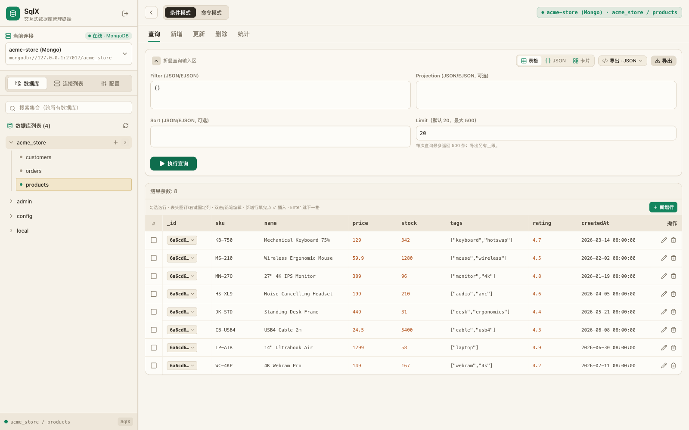
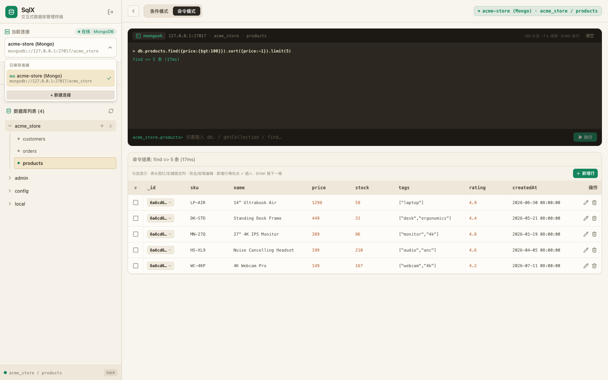
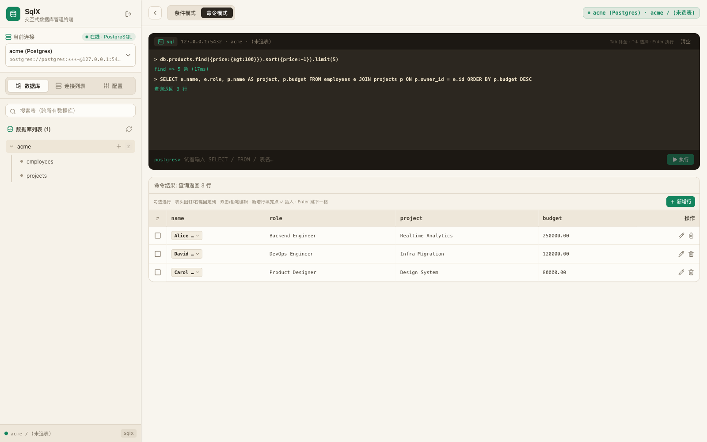

<div align="center">

# SqlX

**A self-hosted web client for MongoDB, PostgreSQL and MySQL — one UI for all your databases.**

[](LICENSE)
[](package.json)
[](#contributing)

[English](README.md) · [简体中文](README.zh-CN.md)



</div>

## Why SqlX

Desktop database clients are heavy, licensed per-seat, and useless when your data lives inside a private network. SqlX is a single lightweight Node.js service you drop on any server — then manage MongoDB, PostgreSQL and MySQL from the browser, on desktop or mobile.

- **One binary-like deploy** — `git clone`, `npm install`, `npm start`. No build step required, frontend ships prebuilt.
- **Three engines, one UI** — save multiple connections across MongoDB / PostgreSQL / MySQL and switch instantly.
- **Spreadsheet-grade editing** — double-click cells to edit, add rows inline, batch select / copy / export / delete.
- **A real terminal** — mongosh-style commands for Mongo, raw SQL for Postgres/MySQL, with tab completion and history.
- **Safe by default** — password login (HMAC-signed cookies), masked connection URIs, rate limiting.

## Features

| | |
|---|---|
| Connection manager | Save / connect / disconnect / delete, three database types side by side |
| Schema explorer | Database tree, cross-database search, context menu for indexes & stats |
| Query builder | Filter / Projection / Sort / Limit with JSON & EJSON support |
| Terminal mode | `db.users.find({...}).sort({...})` for Mongo, plain SQL for PG/MySQL |
| Interactive table | Inline cell editing, row editor dialog, column pinning, batch operations |
| Views & export | Table / JSON / Card views; export JSON, YAML, CSV, NDJSON |
| DDL operations | Create collections / tables, create & drop indexes from the UI |
| Smart Mongo connect | Auto-retries `directConnection` and `authSource` variants on auth failure |

<div align="center">


</div>

## Quick start

Requires Node.js >= 18.

```bash
git clone https://github.com/pzdemos/mongox.git sqlx
cd sqlx
npm install
MONGOX_PASSWORD=change-me npm start
```

Open `http://localhost:5000`, log in with the password you just set, and add your first connection.

### Configuration

| Env var | Required | Default | Description |
|---|---|---|---|
| `MONGOX_PASSWORD` | yes | — | Login password for the web UI |
| `PORT` | no | `5000` | HTTP port |

### Run with PM2

```bash
export MONGOX_PASSWORD='<strong-password>'
pm2 start ecosystem.config.cjs
```

## Security notes

- Every API route (except `/health` and `/login`) requires a login session; sessions are HMAC-signed cookies valid for 7 days.
- Saved connection URIs are stored server-side (`data/`, gitignored) and always masked in API responses.
- SqlX is a database client — treat it like one. Run it behind HTTPS and restrict access (VPN / firewall / reverse-proxy auth) when exposed to the internet.

## Architecture

- **Server** — Express + native drivers (`mongodb`, `pg`, `mysql2`). REST API under `/mongo/api`, documented in [docs/API.md](docs/API.md).
- **Frontend** — React 19 + Tailwind, developed in [pzdemos/SqlX](https://github.com/pzdemos/SqlX); prebuilt assets are shipped in `public/`.
- **Legacy UI** — the original zero-dependency single-page app is preserved at `/v1/`.

## Roadmap

- [x] English / Chinese UI (browser language + in-app switcher)
- [ ] Official Docker image
- [ ] Query history & saved queries
- [ ] Multi-user accounts, roles and audit log
- [ ] More engines: SQLite, Redis

## Contributing

Issues and pull requests are welcome. For frontend changes, see the [SqlX frontend repo](https://github.com/pzdemos/SqlX).

## License

[MIT](LICENSE)
